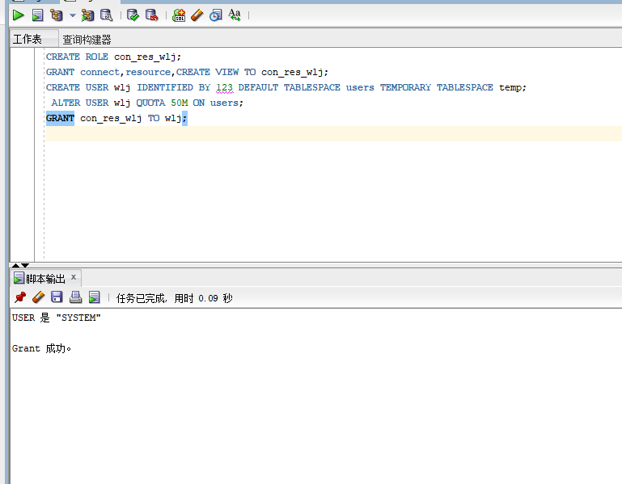
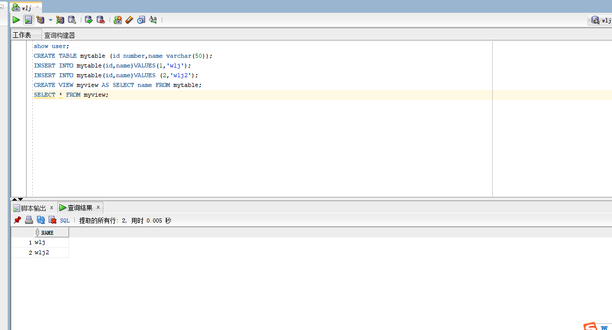
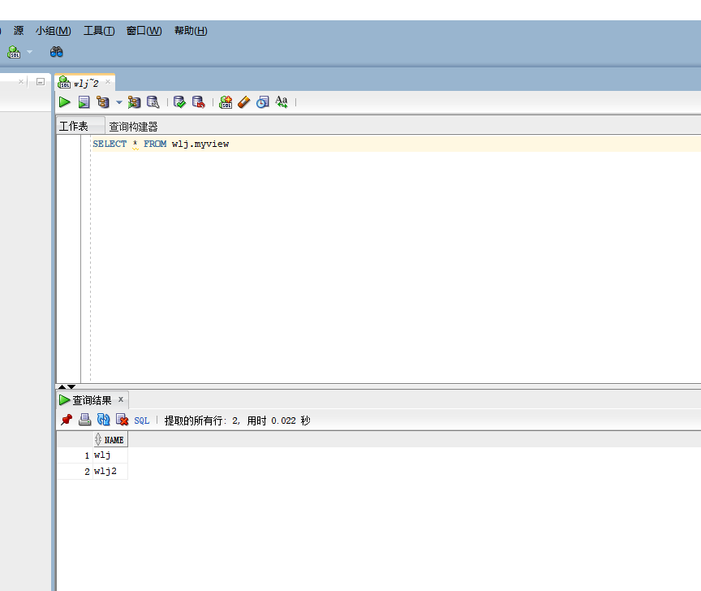
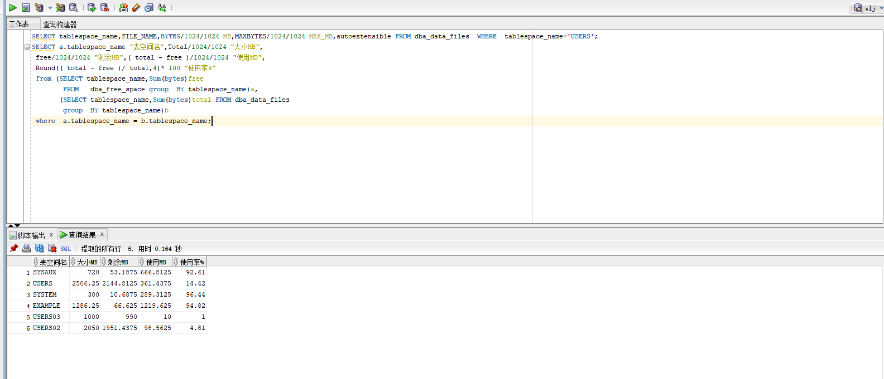
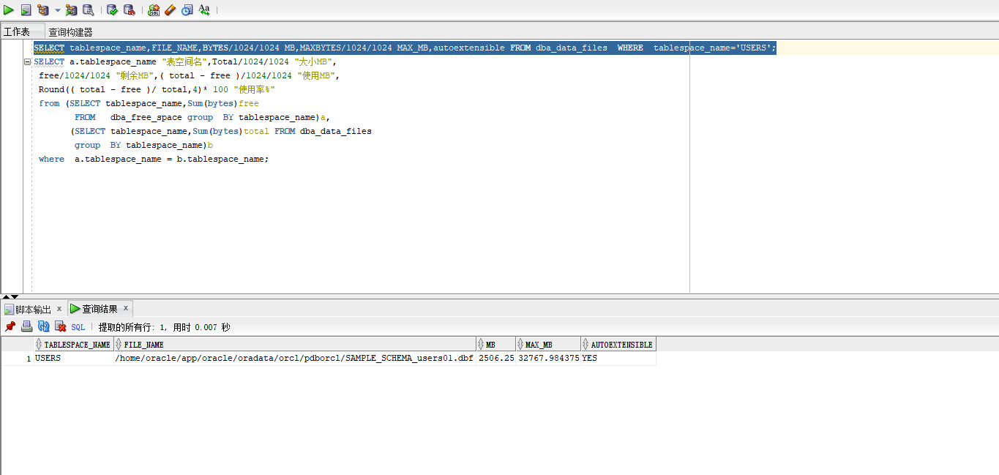

## 实验二：用户及权限管理

## 实验目的：

掌握用户管理、角色管理、权根维护与分配的能力，掌握用户之间共享对象的操作技能。

---

## **实验创建用户名:wlj  角色:con_res_wlj**  

- 角色创建、授权和空间分配

  实验结果截图：
  
  
  
  分析：用system用户登录到数据库，首先用create语句创建角色；之后用grant 将 connect,resource授权给con_res_wlj角色；然后创建wlj用户并分配空间；最后将角色的权限授权给创建的用户。
  
  
  
  
- 创建表和视图，授权hr
  
    实验结果截图：

    
  
    分析：创建mytable表，之后将wlj和wlj2分别插入到表中。然后在mytable表中创建view视图，最后将myview的select权限授权给hr用户。
- 查询视图
  
    实验结果截图：

    
    
    分析：在hr用户中查询用户授予它的视图myview
    
- 查看数据库使用情况
  
    实验结果截图：

     
  
     
     
     分析：通过oracle查询语句，可以查看表空间的数据库文件，以及每个文件的磁盘占用情况。在查询出来的数据情况我们可以直观的感受到表空间的使用率，在表二中查询了users中的具体数据如：autoextensible和MAX_MB可以看出数据文件的最大容量是32767.98MB以及数据文件是自增的。