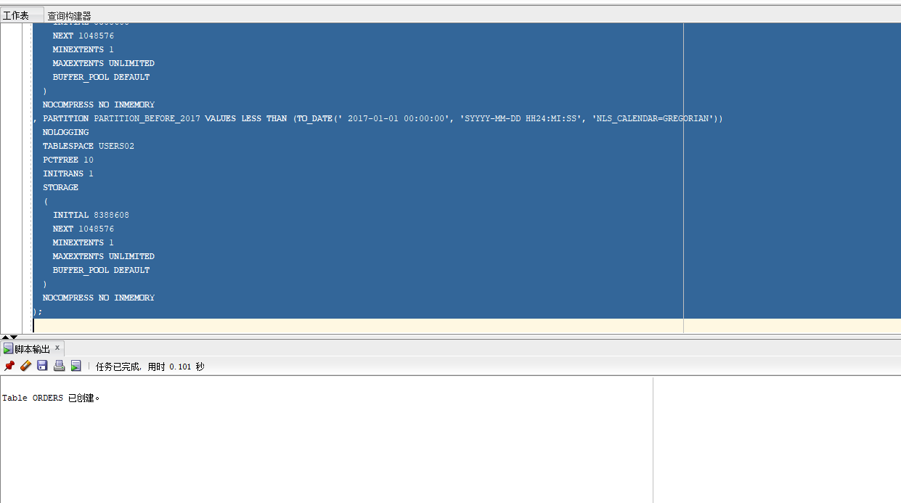

## 实验四：对象管理

## 实验目的：

了解Oracle表和视图的概念，学习使用SQL语句Create Table创建表，学习Select语句插入，修改，删除以及查询数据，学习使用SQL语句创建视图，学习部分存储过程和触发器的使用。

---

## 实验创建用户名： wlj


- 首先在删除表和序列，同时也会删除主外键、触发器、程序包。经过这一些操作之后进行部门表DEPARTMENTS、产品表PRODUCTS、员工表EMPLOYEES、订单表ORDERS、订单详单
ORDER_DETAILS等表的创建。

```
sql部分代码代码：
CREATE TABLE DEPARTMENTS
(
  DEPARTMENT_ID NUMBER(6, 0) NOT NULL
, DEPARTMENT_NAME VARCHAR2(40 BYTE) NOT NULL
, CONSTRAINT DEPARTMENTS_PK PRIMARY KEY
  (
    DEPARTMENT_ID
  )
  USING INDEX
  (
      CREATE UNIQUE INDEX DEPARTMENTS_PK ON DEPARTMENTS (DEPARTMENT_ID ASC)
      NOLOGGING
      TABLESPACE USERS
      PCTFREE 10
      INITRANS 2
      STORAGE
      (
        INITIAL 65536
        NEXT 1048576
        MINEXTENTS 1
        MAXEXTENTS UNLIMITED
        BUFFER_POOL DEFAULT
      )
      NOPARALLEL
  )
  ENABLE
)
NOLOGGING
TABLESPACE USERS
PCTFREE 10
INITRANS 1
STORAGE
(
  INITIAL 65536
  NEXT 1048576
  MINEXTENTS 1
  MAXEXTENTS UNLIMITED
  BUFFER_POOL DEFAULT
)
NOCOMPRESS NO INMEMORY NOPARALLEL;

CREATE TABLE EMPLOYEES
(
  EMPLOYEE_ID NUMBER(6, 0) NOT NULL
, NAME VARCHAR2(40 BYTE) NOT NULL
, EMAIL VARCHAR2(40 BYTE)
, PHONE_NUMBER VARCHAR2(40 BYTE)
, HIRE_DATE DATE NOT NULL
, SALARY NUMBER(8, 2)
, MANAGER_ID NUMBER(6, 0)
, DEPARTMENT_ID NUMBER(6, 0)
, PHOTO BLOB
, CONSTRAINT EMPLOYEES_PK PRIMARY KEY
  (
    EMPLOYEE_ID
  )
  USING INDEX
  (
      CREATE UNIQUE INDEX EMPLOYEES_PK ON EMPLOYEES (EMPLOYEE_ID ASC)
      NOLOGGING
      TABLESPACE USERS
      PCTFREE 10
      INITRANS 2
      STORAGE
      (
        INITIAL 65536
        NEXT 1048576
        MINEXTENTS 1
        MAXEXTENTS UNLIMITED
        BUFFER_POOL DEFAULT
      )
      NOPARALLEL
  )
  ENABLE
)
...
CREATE INDEX EMPLOYEES_INDEX1_NAME ON EMPLOYEES (NAME ASC)
NOLOGGING
TABLESPACE USERS
PCTFREE 10
INITRANS 2
STORAGE
(
  INITIAL 65536
  NEXT 1048576
  MINEXTENTS 1
  MAXEXTENTS UNLIMITED
  BUFFER_POOL DEFAULT
)
NOPARALLEL;
...

CREATE TABLE PRODUCTS
(
  PRODUCT_NAME VARCHAR2(40 BYTE) NOT NULL
, PRODUCT_TYPE VARCHAR2(40 BYTE) NOT NULL
, CONSTRAINT PRODUCTS_PK PRIMARY KEY
  (
    PRODUCT_NAME
  )
  ENABLE
)
LOGGING
TABLESPACE "USERS"
PCTFREE 10
INITRANS 1
STORAGE
(
  INITIAL 65536
  NEXT 1048576
  MINEXTENTS 1
  MAXEXTENTS 2147483645
  BUFFER_POOL DEFAULT
);

ALTER TABLE PRODUCTS
ADD CONSTRAINT PRODUCTS_CHK1 CHECK
(PRODUCT_TYPE IN ('耗材', '手机', '电脑'))
ENABLE;
```


  实验结果截图：
  
  
  
  
  
  
  
  
  
  
  
  
  实验分析：在上次实验中system给自己用户wlj用GRANT语句授权创建了分区user02，所以这次实验直接用wlj用户创建了这几个需要用到表格，用CREATE TABLE语句创建表格，并且构建表的结构，如字段名，数据类型、主键等表结构。并且设置NOCOMPRESS NO INMEMORY NOPARALLEL。
  
  - 序列的应用与触发器的应用
```
CREATE GLOBAL TEMPORARY TABLE "ORDER_ID_TEMP"
   (	"ORDER_ID" NUMBER(10,0) NOT NULL ENABLE,
	 CONSTRAINT "ORDER_ID_TEMP_PK" PRIMARY KEY ("ORDER_ID") ENABLE
   ) ON COMMIT DELETE ROWS ;

   COMMENT ON TABLE "ORDER_ID_TEMP"  IS '用于触发器存储临时ORDER_ID';
   ...
   CREATE INDEX ORDERS_INDEX_DATE ON ORDERS (ORDER_DATE ASC)
LOCAL
(
  PARTITION PARTITION_BEFORE_2016
    TABLESPACE USERS
    PCTFREE 10
    INITRANS 2
    STORAGE
    (
      INITIAL 8388608
      NEXT 1048576
      MINEXTENTS 1
      MAXEXTENTS UNLIMITED
      BUFFER_POOL DEFAULT
    )
    NOCOMPRESS
, PARTITION PARTITION_BEFORE_2017
    TABLESPACE USERS02
    PCTFREE 10
    INITRANS 2
    STORAGE
    (
      INITIAL 8388608
      NEXT 1048576
      MINEXTENTS 1
      MAXEXTENTS UNLIMITED
      BUFFER_POOL DEFAULT
    )
    NOCOMPRESS
)
STORAGE
(
  BUFFER_POOL DEFAULT
)
NOPARALLEL;

...
CREATE OR REPLACE EDITIONABLE TRIGGER "ORDERS_TRIG_ROW_LEVEL"
BEFORE INSERT OR UPDATE OF DISCOUNT ON "ORDERS"
FOR EACH ROW 
declare
  m number(8,2);
BEGIN
  if inserting then
       :new.TRADE_RECEIVABLE := - :new.discount;
  else
      select sum(PRODUCT_NUM*PRODUCT_PRICE) into m from ORDER_DETAILS where ORDER_ID=:old.ORDER_ID;
      if m is null then
        m:=0;
      end if;
      :new.TRADE_RECEIVABLE := m - :new.discount;
  end if;
END;
/

ALTER TRIGGER "ORDERS_TRIG_ROW_LEVEL" DISABLE;
...
  CREATE OR REPLACE EDITIONABLE TRIGGER "ORDER_DETAILS_SNTNS_TRIG"
AFTER DELETE OR INSERT OR UPDATE ON ORDER_DETAILS
declare
  m number(8,2);
BEGIN
  FOR R IN (SELECT ORDER_ID FROM ORDER_ID_TEMP)
  LOOP
    --DBMS_OUTPUT.PUT_LINE(R.ORDER_ID);
    select sum(PRODUCT_NUM*PRODUCT_PRICE) into m from ORDER_DETAILS
      where ORDER_ID=R.ORDER_ID;
    if m is null then
      m:=0;
    end if;
    UPDATE ORDERS SET TRADE_RECEIVABLE = m - discount
      WHERE ORDER_ID=R.ORDER_ID;
  END LOOP;
  --delete from ORDER_ID_TEMP; 
END;
```

实验结果截图：


    

    

    

    

    

  
实验分析：插入ORDERS和ORDER_DETAILS 两个表的数据时，主键ORDERS.ORDER_ID, ORDER_DETAILS.ID的值必须通过序列SEQ_ORDER_ID和SEQ_ORDER_ID取得，不能手工输入一个数字。同时在维护ORDER_DETAILS的数据时（insert,delete,update）要同步更新ORDERS表订单应收货款ORDERS.Trade_Receivable的值。在创建触发器时需要使用ALTER TRIGGER "ORDERS_TRIG_ROW_LEVEL" DISABLE语句表示在批量插入订单数据之前，禁用触发器。同时需要delete from ORDER_ID_TEMP这句话很重要，否则可能一直不释放空间，后继插入会非常慢。

  - 插入数据
  
 实验结果截图：


实验分析：首先我们创建视图之后就插入DEPARTMENTS，EMPLOYEES数据，之后再批量插入订单数据，需要注意ORDERS.TRADE-RECEIVABLE（订单应收款）的自动计算,注意插入数据的速度，但在触发器关闭的情况下，需要手工计算每个订单的应收金额，最后动态增加一个PARTITION_BEFORE_2018分区。

  - 查询数据
 
##### 查询某个员工的信息
```sql
select * from view_order_details where order_id = 1
```
   - 实验结果截图：


##### 递归查询某个员工及其所有下属，子下属员工

```sql
WITH A (EMPLOYEE_ID,NAME,EMAIL,PHONE_NUMBER,HIRE_DATE,SALARY,MANAGER_ID,DEPARTMENT_ID) AS
  (SELECT EMPLOYEE_ID,NAME,EMAIL,PHONE_NUMBER,HIRE_DATE,SALARY,MANAGER_ID,DEPARTMENT_ID
    FROM employees WHERE employee_ID = 11
    UNION ALL
  SELECT B.EMPLOYEE_ID,B.NAME,B.EMAIL,B.PHONE_NUMBER,B.HIRE_DATE,B.SALARY,B.MANAGER_ID,B.DEPARTMENT_ID
    FROM A, employees B WHERE A.EMPLOYEE_ID = B.MANAGER_ID)
SELECT * FROM A;
```
   - 实验结果截图：


##### 查询订单表，并且包括订单的订单应收货款
```sql
select a.*,b.应收货款 from orders a
left join (select sum(order_details.product_num * order_details.product_price) 应收货款,order_id from order_details group by order_details.order_id) b
on a.order_id = b.order_id
```
   - 实验结果截图：


##### 查询订单详表，要求显示订单的客户名称和客户电话，产品类型用汉字描述。

```sql
SELECT b.customer_name 客户名称, b.customer_tel 客户电话,c.product_type 产品类型 FROM order_details a ,orders b, products c
where a.order_id = b.order_id and c.product_name = a.product_name
```

   - 实验结果截图：


##### 查询出所有空订单，即没有订单详单的订单

```sql
SELECT * FROM orders a
LEFT JOIN order_details b on a.order_id = b.order_id
where b.order_id is null
```

   - 实验结果截图：


##### 查询部门表，同时显示部门的负责人姓名。

```sql
SELECT DISTINCT a.*, c.name 部门领导 FROM departments a, employees b,employees c
WHERE a.department_id = b.department_id and b.manager_id = c.employee_id
```

  - 实验结果截图：


