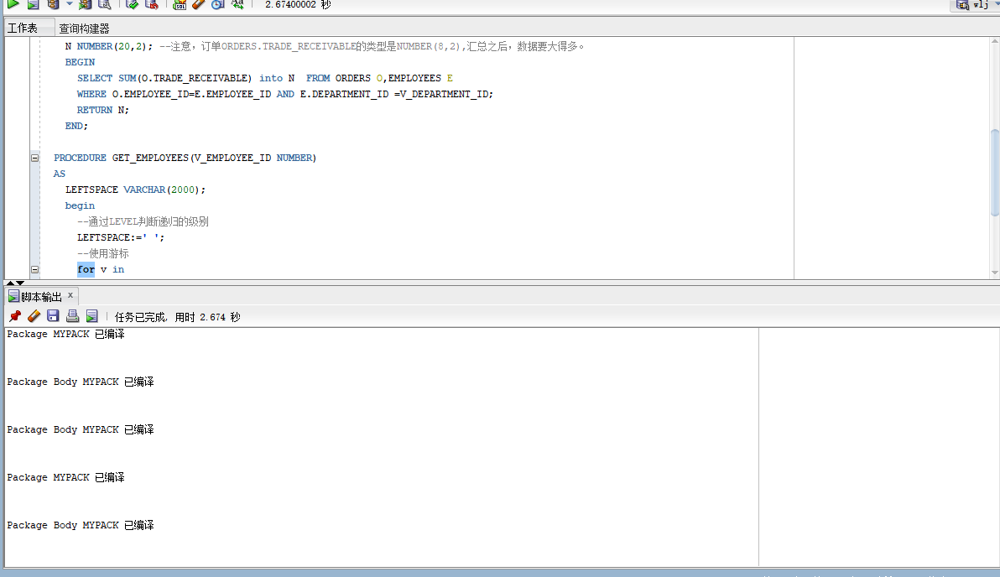
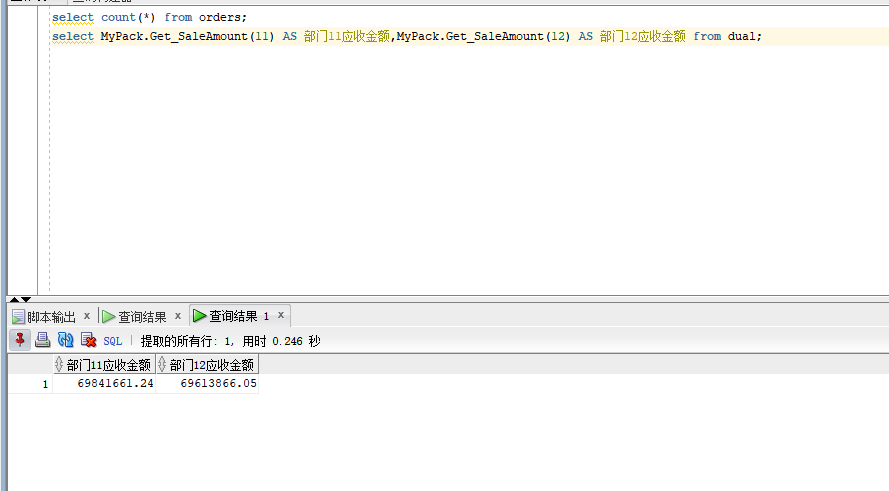
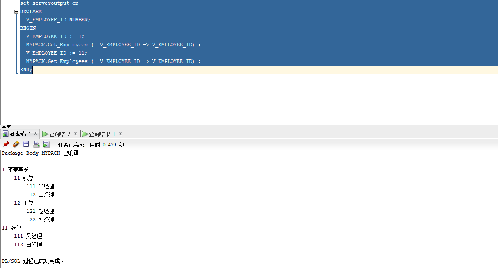

## 实验五：PL/SQL编程

## 实验目的：

- 了解PL/SQL语言结构
- 了解PL/SQL变量和常量的声明和使用方法
- 学习条件语句的使用方法
- 学习分支语句的使用方法
- 学习循环语句的使用方法
- 学习常用的PL/SQL函数
- 学习包，过程，函数的用法。

---

## 实验创建用户名： wlj


- 创建一个包(Package)，包名是MyPack。在MyPack中创建一个函数SaleAmount ，查询部门表，统计每个部门的销售总金额，每个部门的销售额是由该部门的员工(ORDERS.EMPLOYEE_ID)完成的销售额之和。函数SaleAmount要求输入的参数是部门号，输出部门的销售金额。在过程中使用游标，递归查询某个员工及其所有下属，子下属员工。

```
sql部分代码代码：
create or replace PACKAGE MyPack IS
  FUNCTION Get_SaleAmount(V_DEPARTMENT_ID NUMBER) RETURN NUMBER;
  PROCEDURE Get_Employees(V_EMPLOYEE_ID NUMBER);
END MyPack;

create or replace PACKAGE BODY MyPack IS
  FUNCTION Get_SaleAmount(V_DEPARTMENT_ID NUMBER) RETURN NUMBER
  AS
    N NUMBER(20,2); --注意，订单ORDERS.TRADE_RECEIVABLE的类型是NUMBER(8,2),汇总之后，数据要大得多。
    BEGIN
      SELECT SUM(O.TRADE_RECEIVABLE) into N  FROM ORDERS O,EMPLOYEES E
      WHERE O.EMPLOYEE_ID=E.EMPLOYEE_ID AND E.DEPARTMENT_ID =V_DEPARTMENT_ID;
      RETURN N;
    END;
     PROCEDURE GET_EMPLOYEES(V_EMPLOYEE_ID NUMBER)
  AS
    LEFTSPACE VARCHAR(2000);
    begin
      --通过LEVEL判断递归的级别
      LEFTSPACE:=' ';
      --使用游标
      for v in
      (SELECT LEVEL,EMPLOYEE_ID,NAME,MANAGER_ID FROM employees
      START WITH EMPLOYEE_ID = V_EMPLOYEE_ID
      CONNECT BY PRIOR EMPLOYEE_ID = MANAGER_ID)
      LOOP
        DBMS_OUTPUT.PUT_LINE(LPAD(LEFTSPACE,(V.LEVEL-1)*4,' ')||
                             V.EMPLOYEE_ID||' '||v.NAME);
      END LOOP;
    END;
END MyPack;

```


  实验结果截图：
  
  
  
  
  实验分析： 包也是一种命名pl/sql块，和存储过程、函数一下，都是在数据库启动的时候就载入内存的。开销的大小很难判断，因为你不用包，但是要完成包的功能的话，还是要用PL/SQL来完成的，服务器一样有开销。相对来说，用包少了SQL的语法分析、解释过程，开销还少一点。包可以将任何出现在块声明的语句(过程,函数,游标,游标,类型,变量)放于包中,相当于一个容器.将声明语句放入包中的好处是:用户可以从其他PL/SQL块中对其进行引用,因此包为PL/SQL提供了全程变量.所以在本次实验中在package中使用游标进行递归查询，节省了服务器开销，提高了效率。
  


  - 测试函数Get_SaleAmount()测试方法：
  
``` sql

select count(*) from orders;
select MyPack.Get_SaleAmount(11) AS 部门11应收金额,MyPack.Get_SaleAmount(12) AS 部门12应收金额 from dual;

```
  
 实验结果截图：




实验分析：在pl/sql编译过程中，已经创建了函数SaleAmount，来统计每个部门的销售金额，所以用select mypack.get_SaleAmount(11)来调用包中的函数，并向其中传参，进行查询销售额。

  - 过程Get_Employees()测试代码：
 

```sql
set serveroutput on
DECLARE
  V_EMPLOYEE_ID NUMBER;    
BEGIN
  V_EMPLOYEE_ID := 1;
  MYPACK.Get_Employees (  V_EMPLOYEE_ID => V_EMPLOYEE_ID) ;  
  V_EMPLOYEE_ID := 11;
  MYPACK.Get_Employees (  V_EMPLOYEE_ID => V_EMPLOYEE_ID) ;    
END;
```
   - 实验结果截图：



实验分析：通过调用Mypack中的Get_Employees()进行查询，同时通过=>函数在调用存储过程时，指定参数名进行调用。一般是， 某些参数有默认值的时候，你需要跳过某些参数来进行调用。所以通过调用函数进行数据查询。