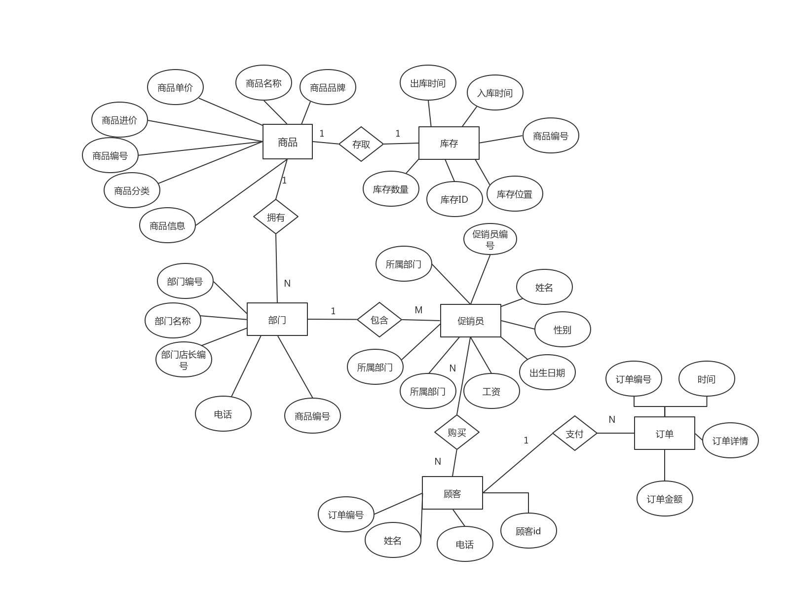
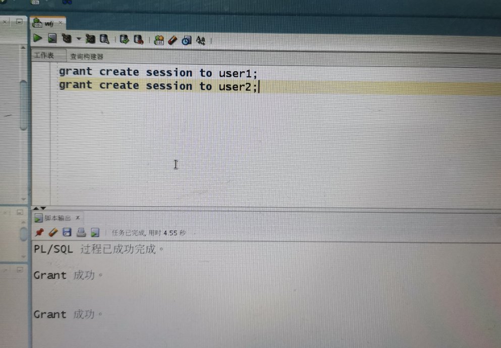
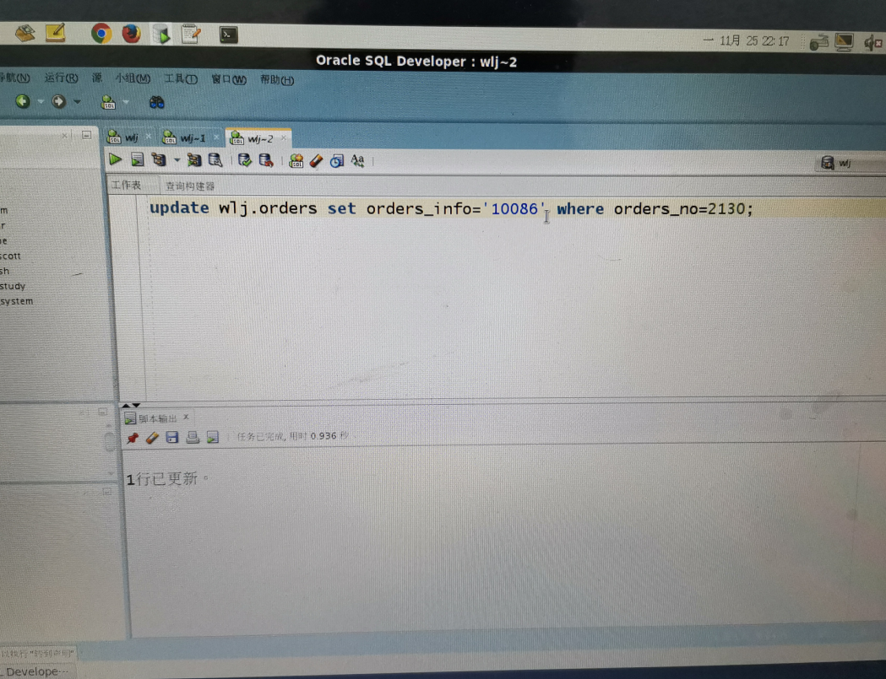

## 实验六： 基于Oracle的超市系统数据库设计

## 实验背景：

随着超市规模的发展不断扩大，商品数量急剧增加，有关商品的各种信息量也成倍增长。超市时时刻刻都需要对商品各种信息进行统计分析。而大型的超市管理系统功能过于强大而造成操作繁琐降低了小超市的工作效率。
超市管理系统是市场上最流行的超市上常用的系统之一，它主要包含以下几个模块:系统权限的设定、原始数据录入、数据的汇总及查询等。从而，实现对进货、销售及员工信息等实现全面、动态、及时的管理。

## 数据库设计环境：
- 数据库软件系统：oracle数据库
- 开发平台和开发工具：Linux centos6和SQL Developer

---

## 实验创建用户名： wlj 
## 数据库名称：wljpdb
---

### 对象实体
本次超市系统主要有6个实体：商品、部门、库存、促销员、顾客、订单
- 商品（goods）：商品编号(goods_no)，商品名称（goods_name），商品分类（goods_class），商品进价（intake_price）,商品单价（outtake_price),商品品牌（goods_brand），商品规格（goods_info）
- 库存（stock）：商品编号(goods_no)，库存编号(stock_no)，库存数量(size)，库存位置(position)，入库时间(instore_time)，出库时间(outstock_time)，出库商品数量（outgoods_size）
- 部门（department）：部门编号（department_no）,部门名称（department_name）,部门店长（department_minister），电话（phone），商品编号（goods_no）
- 促销员（promoter）：促销员编号（promoter_no）,姓名（promoter_name）,性别（sex），出生日期（birthday），所属部门编号（department_no），入职时间（admission_time），工资(salary)
- 订单（orders）：订单编号（orders_no），时间（orders_time）,订单详情（orders_info）,订单金额（orders_price）
- 顾客（customer）：订单编号（orders_no），姓名（customer_name），电话（customer_tel），顾客id（customer_id），

### ER图


---

### 业务逻辑
- 商品库存业务
库存管理是指在上产经营中为销售和耗用而存储的各种资产。企业存货不当都会增加不必要的费用:存货过多将导致物资的积压、存储费用增加、流动资金周转不利，并且过量的库存会掩盖管理不善的问题。存货不足则影响企业的正常销售活动。库存管理的目标是需求最佳存货数量，使库存的成本总额最小化。其主要业务如下:产品入库、出库、盘库等日常处理。
科学合理地确定某库存物资的库存控制参数。进行严格的库存控制工作。汇总统计各类库存数据，反应和监督储备资金占用及采购资金使用情况。

- 促销业务
销售对一个企业的生存和发展是至关重要的，它不再是传统意义上的“卖东西”，它对外关系到企业产品、服务和企业形象等多方面因素，对内涉及到销售、库存、财务等信息。此外信息化的高速发展为企业的销售工作提出了新的挑战，封闭意味着落后，超市要抓住时机，引入现代化的销售管理模式，实施企业的信息化、智能化销售管理，才能将利益最大化。
本系统业务为促销员与部门的联系，进行促销业务的实施。

## 详细设计
- 首先在sys数据库下面创建wljpdb和admin wlj以及创建路径
```
create p1uggable database wljpdb admin user wlj identified by 123 file_name_convert=('/home/oracle/app/oracle/oradata/orc1/pdbseed/','/home/orac1e/app/orac1e/oradata/orc1/wljpdb');|

```


  实验结果截图：
  
  

  - 数据库授权cdb到pdb
```
Alter session set container =wljpdb；
Grant dba to wlj；

```


  实验结果截图：
  
  

  
  - 表空间的建立
```
create tablespace Wlj_space1
datafile '/home/oracle/app/oracle/oradata/orcl/wljpdb/wlj_space1.dbf' 
size 150M 
autoextend on next 50m
maxsize unlimited;
create tablespace Wlj_space1
datafile '/home/oracle/app/oracle/oradata/orcl/wljpdb/wlj_space1.dbf' 
size 150M 
autoextend on next 50m
maxsize unlimited;
create tablespace Wlj_space1
datafile '/home/oracle/app/oracle/oradata/orcl/wljpdb/wlj_space1.dbf' 
size 150M 
autoextend on next 50m
maxsize unlimited;

```


  实验结果截图：
  
  

  ## 创建表以及实现表分区操作
  表进行分区后，逻辑上表仍然是一张完整的表，只是将表中的数据在物理上存放到多个表空间(物理文件上)，这样查询数据时，不至于每次都扫描整张表。所以本次使用分为三张表的目的便是如此。用NOCOMPRESS NO INMEMORY语句来缓解了内存资源的压力，这就将有限的资源分配给更需要的用户，增加了数据库资源的利用率。
  - 商品表（goods）
```
create table goods (
    goods_no char(5) not null primary key,
    goods_name char(20) not null,
    goods_class char(8),
    goods_info char(10),
    goods_brand char(10),
    intake_price float not null CHECK(intake_price > 0),
    outtake_price float not null CHECK(outtake_price > 0)
)TABLESPACE wlj_space1;

```


  实验结果截图：
  
  

- 库存表（stock）
```
Sql语句如下：create table stock (
    goods_no char(5) not null,
    stock_no char(5) not null,
    size_ char(10),
    position_ char(20),
    instore_time date not null,
   outstock_time date not null,
    outgoods_size char(10),
    CONSTRAINT stock_goods_key foreign key (goods_no) references goods(goods_no)
    )TABLESPACE wlj_space1;

```


  实验结果截图：
  
  

- 3.部门表（department）
```
create table department (
    department_no char(5) not null primary key,
    department_name char(10) not null,
    department_minister char(5) not null,
    phone char(11),
    goods_no char(5),
    CONSTRAINT department_goods_key FOREIGN KEY (goods_no) REFERENCES goods (goods_no)
)TABLESPACE wlj_space1;

```


  实验结果截图：
  
  

  - 促销员表（promoter）
```
create table promoter (
    promoter_no char(5) not null primary key,
    promoter_name char(10) not null,
    sex char(2) not null CHECK(sex IN ('男','女')),
    department_no char(5) not null,
    birthday date ,
    admission_time date not null,
    salary float not null,
    CONSTRAINT promoter_department_key FOREIGN KEY (department_no) REFERENCES department (department_no)

```


  实验结果截图：
  
  

- 订单表（orders）
```
CREATE TABLE orders 
(
  orders_no CHAR(5 BYTE) NOT NULL primary key 
, orders_info CHAR(15 BYTE) NOT NULL 
, orders_price FLOAT(126) 
, orders_time DATE NOT NULL 
) partition by range (orders_time)
  (
partition p1 values LESS THAN (TO_DATE(' 2018-01-01 00:00:00', 'SYYYY-MM-DD HH24:MI:SS', 'NLS_CALENDAR=GREGORIAN')) tablespace wlj_space1,

    partition p2 values LESS THAN (TO_DATE(' 2019-01-01 00:00:00', 'SYYYY-MM-DD HH24:MI:SS', 'NLS_CALENDAR=GREGORIAN')) tablespace wlj_space2,

    partition p3 values LESS THAN (TO_DATE(' 2020-01-01 00:00:00', 'SYYYY-MM-DD HH24:MI:SS', 'NLS_CALENDAR=GREGORIAN')) tablespace wlj_space3,
    
    partition p4 values LESS THAN (MAXVALUE) tablespace wlj_space4)

```


  实验结果截图：
  
  

  - 顾客表(customer)
```
create table customer(
    customer_id char(5) not null primary key,
    customer_name char(10) not null,
    customer_tel  char(11),
    orders_no char(5) not null,
    CONSTRAINT customer_orders_key FOREIGN KEY (orders_no) REFERENCES orders (orders_no)
)TABLESPACE wlj_space1;

```


  实验结果截图：
  
  
  ## 创建用户，并授权
 分别创建俩个用户user1和user2，并且授权他们只能使用space1表空间，同时创建两个角色role1，role2，并分别赋予role1，role2读任何表和读、修改任何表的权利。同时还要用grant create session to user1语句授予不同用户进入pdb的权利。
```
create user user1 IDENTIFIED by 123;
create user user2 IDENTIFIED by 123;
alter user user1 quota unlimited on wlj_space1;
alter user user2 quota unlimited on wlj_space1;
grant create session to user1;
grant create session to user2;

create role role1;
create role role2;
grant select any table to role1;
grant select any table to role2;
grant update any table to role2;
grant role1 to user1;
grant role2 to user2;

```


  实验结果截图：
  
  
 
  
  ## 向数据库中批量的插入数据
 在已经创建好的数据库中批量插入数据用循环进行数据插入。
```
declare
dt date;
orders_no char(5);
orders_info char(5);
orders_price float;
BEGIN
insert into goods (goods_no,goods_name,goods_class,goods_info,goods_brand,intake_price,outtake_price) values ('1','金龙鱼','日用','食用','金龙鱼',59.9,75.6);
insert into goods (goods_no,goods_name,goods_class,goods_info,goods_brand,intake_price,outtake_price) values ('2','冰红茶','饮料','食用','康师傅',2.3,3.0);
insert into goods (goods_no,goods_name,goods_class,goods_info,goods_brand,intake_price,outtake_price) values ('3','巧克力','休闲','食用','德夫',25.5,35.6);
insert into goods (goods_no,goods_name,goods_class,goods_info,goods_brand,intake_price,outtake_price) values ('4','旺仔牛奶','牛奶','食用','旺仔',32.3,53.4);
insert into goods (goods_no,goods_name,goods_class,goods_info,goods_brand,intake_price,outtake_price) values ('5','徐福记','休闲','食用','徐福记',16.5,55.4);
insert into department (department_no,department_name,department_minister,phone,goods_no) values ('501','日用','zs','110','1');
insert into department (department_no,department_name,department_minister,phone,goods_no) values ('502','酒水','ls','120','2');
insert into department (department_no,department_name,department_minister,phone,goods_no) values ('503','休闲','ww','119','3');
insert into department (department_no,department_name,department_minister,phone,goods_no) values ('504','牛奶','cl','10000','4');

```


  实验结果截图：
  
  

## 切换角色验证分区和授权
- 在user1中无法修改数据，而在user2中可以修改数据，证明权限分配成功，
- 在orders表单中根据时间段不同将其放在了不同的表空间中，通过查询语句也可以说明其分区的正确性！
```
update wlj.orders set orders_info='wlj' where orders_no=2130;
select * from wlj.orders;
select count(*) from wlj.orders partition(p2);
select count(*) from wlj.orders partition(p3);
update wlj.orders set orders_info='wlj';
select * from wlj.orders;
```
 
 
 
 
 
  
## 程序包的创建
在包中建立一个FUNCTION和一个PROCEDURE,功能是：统计orders在一段时间中的订单收入金额，另一个功能是通过输入商品信息查找对应商品并进行分类统计。
 ```
 create or replace PACKAGE MyPack IS
  FUNCTION Get_TOTAL(dt1 char,dt2 char) RETURN NUMBER;
  PROCEDURE get_goods(dt1 char);
END MyPack;
create or replace PACKAGE BODY MyPack IS
FUNCTION Get_TOTAL(dt1 char,dt2 char) RETURN NUMBER
  AS
    N  NUMBER;
    BEGIN
     select sum(orders_price) into N from orders where ORDERS_TIME >= to_date(dt1,'yyyy-mm-dd hh24:mi:ss')
     and ORDERS_TIME <= to_date(dt2,'yyyy-mm-dd hh24:mi:ss');
       RETURN N;
    END;
PROCEDURE get_goods(dt1 char)
  AS
    a1 NUMBER;
    b1 NUMBER;
    c1 NUMBER;
    d1 NUMBER;
    cursor cur is
      select * from goods where GOODS_INFO=dt1;
    begin
      a1 := 0;
      b1 := 0;
      c1 := 0;
      d1 := 0;
      --使用游标
      for v in cur 
 loop
         if v.goods_class = '日用'
	        then a1 := a1 + 1;
         elsif v.goods_class = '饮料'
	        then b1 := b1 + 1;
	     elsif v.goods_class = '休闲'
	        then c1 := c1 + 1;
	     elsif v.goods_class = '牛奶'
	        then d1 := d1 + 1;
	     end if;
     END LOOP;
      DBMS_OUTPUT.PUT_LINE('日用商品种类：' ||  a1);
      DBMS_OUTPUT.PUT_LINE('饮料商品种类：' ||  b1);
      DBMS_OUTPUT.PUT_LINE('休闲商品种类：' ||  c1);
      DBMS_OUTPUT.PUT_LINE('牛奶商品种类：' ||  d1);
    end;
END MyPack;
```
 

 - 由图可见程序包创建成功，在编译完成之后，通过sql语句进行程序包的验证

  
   
    

## 数据库备份
通过rman_level0.sh和rman_level1.sh脚本对数据库进行全备份和全恢复，在数据库出现异常时候，不损失任何数据！
- 全备份
```
[oracle@oracle-pc ~]$ cat rman_level0.sh
[oracle@oracle-pc ~]$ ./rman_level0.sh

```
 
- 查看备份文件和查看备份文件的内容


- 删除数据库文件，模拟数据库文件损坏


- 数据库恢复

首先数据库完全 重启损坏的数据库到mount状态，开始恢复数据库，最后查询数据是否恢复。
```
SQL> shutdown immediate
ORA-01116: 打开数据库文件 83 时出错
ORA-01110: 数据文件 83: '/home/oracle/app/oracle/oradata/orcl/wljpdb/wlj_space3.dbf'
ORA-27041: 无法打开文件
Linux-x86_64 Error: 2: No such file or directory
Additional information: 3
SQL> shutdown abort
ORACLE instance shut down.
SQL> startup mount
ORACLE instance started.
```


由以上截图可知，在删除数据库之后，运行脚本restore database，恢复数据库，恢复成功之后可看到数据库中删除的表空间复原了。证明恢复数据库成功！

## 总结
本次基于oracle数据库超市管理系统，通过linux操作系统在sql developer的开发工具，创建了六个实体模型，同时完成了他们之间相互关联的逻辑关系，同时设计了自动备份方案，一个相对完整的管理系统，在安全性方面还有所欠缺，在后期也会日益完善。