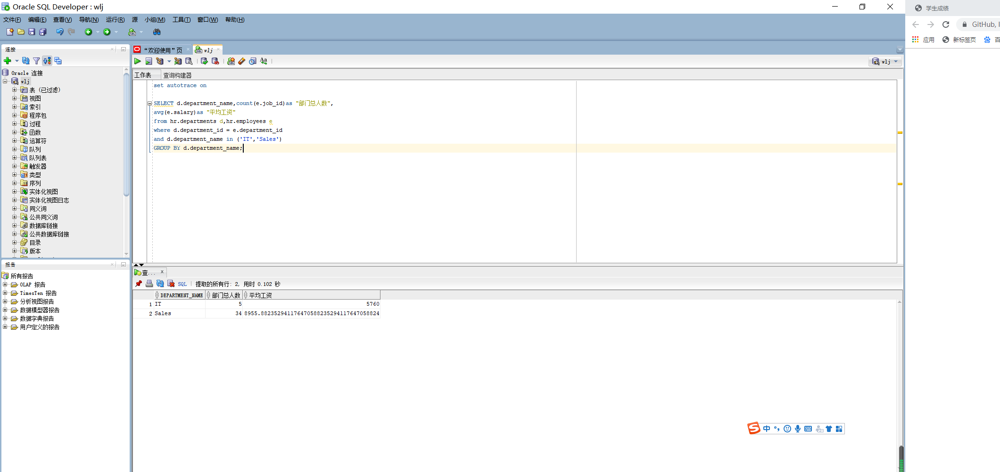
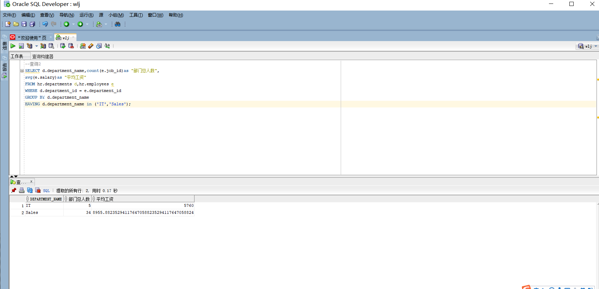
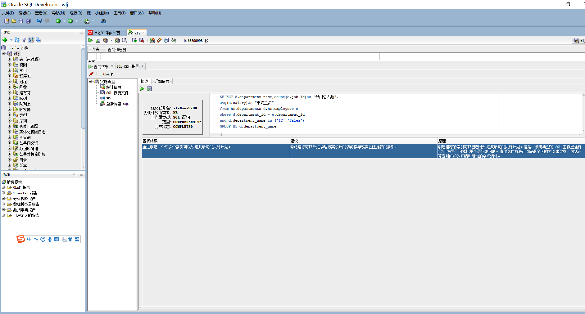
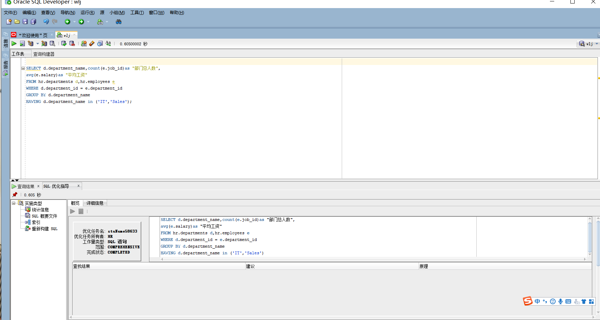

## 实验一：SQL语句的执行计划分析与优化指导

## 1.教材中的查询语句分析

查询结果展示:
---



---

查询1比查询2的sql语句更优！

分析：having是与分组函数一起来使用的。对由sum或其它集合函数运算结果的输出进行限制。它是为了进一步强化过滤条件进行的。所以having函数是在group by之后再进行筛选，where是先筛选之后再进行排序。所以在这个查询中 where的效率比having的效率更高！

- 优化指导：






- 查询1具有优化指导建议考虑改进物理方案设计的访问指导或者创建推荐的索引。

- 查询2无优化指导

### 自己的查询代码

```SQL
SELECT d.department_name,count(e.job_id)as "部门总人数",
avg(e.salary)as "平均工资"
from hr.departments d,hr.employees e
where d.department_id = e.department_id
and 
exists( 
select 1 from hr.departments where d.department_name='IT'
union all 
select 1 from hr.departments where d.department_name='Sales')
GROUP BY d.department_name;
```

- 查询结果：


- 分析：通过使用EXISTS，Oracle会首先检查主查询，然后运行子查询直到它找到第一个匹配项，这就节省了时间。Oracle在执行IN子查询时，首先执行子查询，并将获得的结果列表存放在一个加了索引的临时表中。在执行子查询之前，系统先将主查询挂起，待子查询执行完毕，存放在临时表中以后再执行主查询。这也就是使用EXISTS比使用IN通常查询速度快的原因
